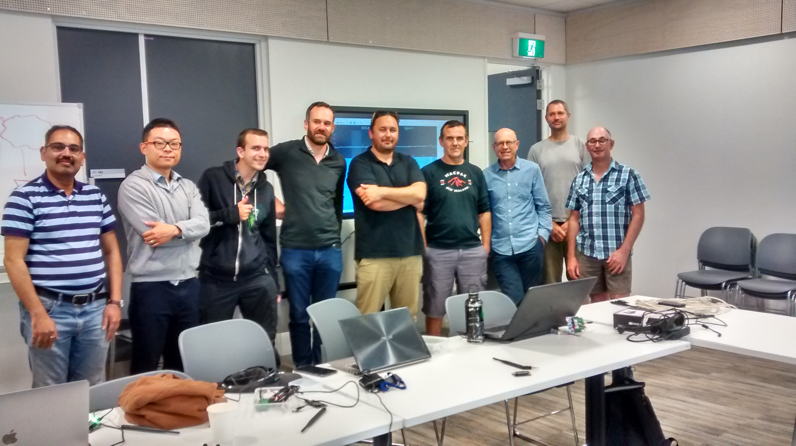
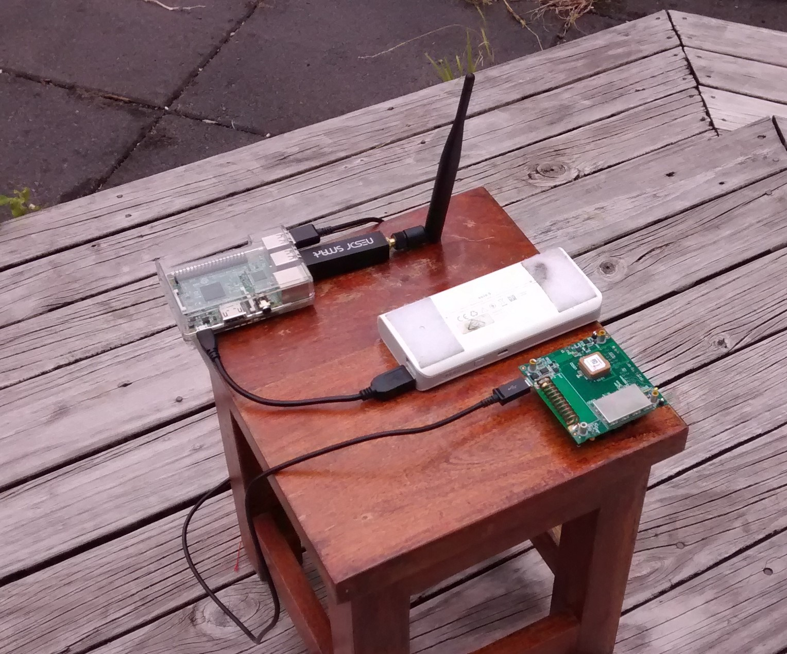

# Myriota Dev Kit Setup

The IoT Auckland Meetup had a two day hackathon workshop to trial out the Myriota dev kit and below are some thoughts and experiences from the setup.

Please contact John if there are any queries.   john@johnmcdermott.nz

This readme isn't meant to be a 'how to' guide, rather confirmation of a practical development environment and what can be done.

We set out to achieve setup of the dev kit and use of the Myriota examples as tutorials.  We gained good experience of the practical steps of following the tutotial that Myriota provide and what is required to use the kit.

<h2>1/  Software Dev Environment</h2>
Using a Windows 10 PC, the setup of Windows Systesm for Linux and Ubuntu was very straightforward to complete and worked exactly as expected.  I recommend using this.</n>

A further tip is to setup a symbolic directory link from the Windows file system to the Ubuntu home directory.  This is more convenient for accessing the Myriota SDK.
i.e.  download and unzip the Myriota SDK to a convenient Windows directory.  Under Ubuntu create a symbolic link to the actual Windows directory.

.png)

Building a binary for download to the dev board
.png)

<h2>2/  Use a Raspberry Pi for the Satellite Simulator</h2>
In the photo at the top of the page you see the satellite simulator setup on a Raspberry Pi with the SDR dongle connected.  The Myriota dev board is adjacent.  This is all running from a portable powerbank.

The advantage of this is that the satellite simulator is now running independently from the dev board software environment.

The Rasperry Pi is setup with the standard Raspian OS, and SSH access is enabled.  The Myriota SDK is copied on the R-Pi, I installed the SDK to ensure the SDR was setup correctly, though the gcc compiler is unnecessary.

.png)

It's also practical to open further SSH sessions to the R-Pi to monitor message upload.  A useful check that data is being received and posted to the Myriota servers.

.png)

If new application binary files need to be uploaded this can also be done via the R-Pi.  Copy the file from the development PC to the R-Pi using a USB drive or ftp within the terminal program.

<h2>View data from Myriota</h2>
Having sent data from the satellite simulator the next step is to retrieve the data from the Myriota backend servers.
  
Assuming that a developer account has been created, the next step is to configure an endpoint terminal.
  
I have created an account at pubnub.com for this purpose, and also using Postman as a test tool.

.png)
  
  
<h2>Next steps?</h2>
With data being received at Pubnub, we can now forward this to other tools or platforms, or use it as a model in setting up other platforms.  Once the Myriota dev kit is live via the satellite service an example will be to forward data to the Owntracks application to create a simple GPS tool.   https://owntracks.org/

I hope this account is of assistance and I can be contacted for advice.  Best wishes to the Myriota team.
  
